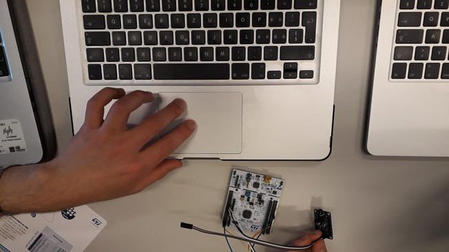

# DSP4.3 - Real-Time DSP

Hi, and welcome to this final module of the DSP course, in which we will learn how to build a real time signal processing system using a general-purpose microcontroller unit. 

Developing DSP applications for a low-level device does not affect the _theory_ behind the algorithms that we implement. However, the constraints imposed by a low-power CPU will demand that we pay particular attention to details such as code efficiency, memory use and input/output routines.

In addition to that, working "close to the metal", so to speak, will give us the chance to look in some detail at the often neglected _physical_ aspect of DSP, namely, the actual electronic components and the signalling protocols that are used to move data around in a complex circuit.

We will focus this module on **audio signal processing**, so as to build a system whose functions we can immediately enjoy; in particular, we will design and implement a variety of **voice scramblers**, that is, devices that you can use to alter your speaking voice in real time and sound, say, like a chipmunk or like Darth Vader.

The skills and the experience needed to port a real-time signal processing algorithm to an embedded board are the province of the truly accomplished DSP engineers; in this module you will be able to get a first taste of the challenges and the struggles of the job, together with the priceless satisfaction of truly "making" a device come to life.

In this online book we will provide you with step-by-step instructions together with links to videos on [Coursera ](https://www.coursera.org/learn/dsp4/)that illustrate all the steps leading to the "finished product". Working with hardware can often prove overwhelming and dealing with the numerous protocols, lengthy documentation, and specific components can be frustrating at times. But, thanks to these notes and the videos, you should be able to navigate around these issues with ease and taste the fun and exciting side of practical DSP right away.

Even if you don't have access to the selected hardware platform, you will still be able to appreciate the main lessons on real-time, low-level programmin and we still recommend you read the [section on Audio I/O theory](audio-peripherals/audio-io.md) nevertheless.

We hope you'll find this tutorial instructive and entertaining!

