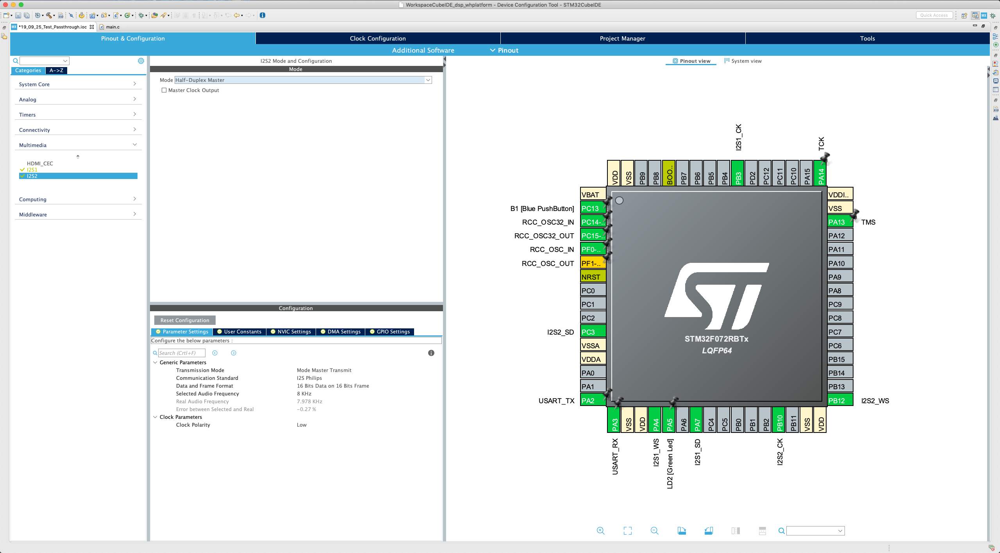
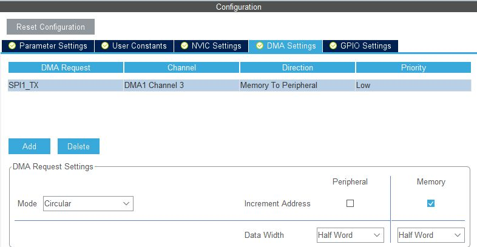
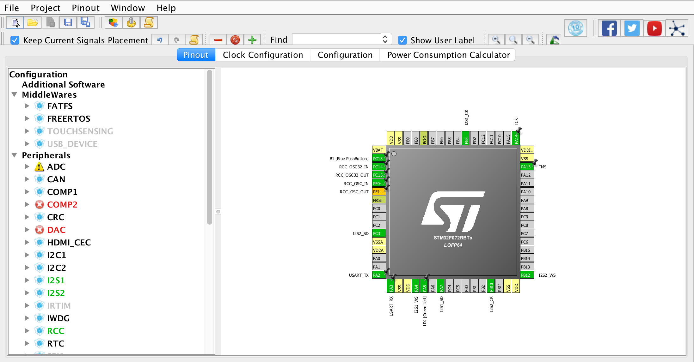
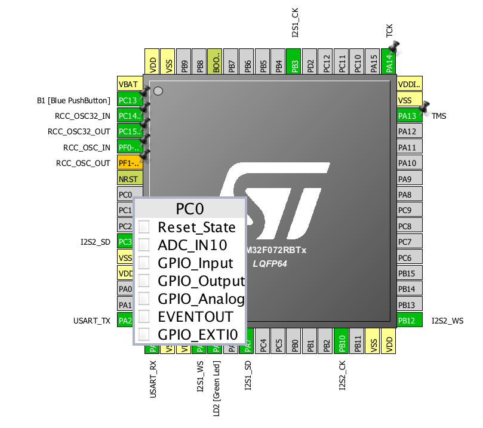
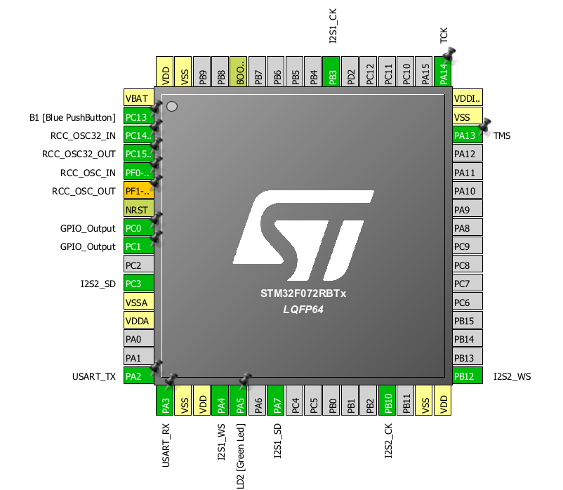
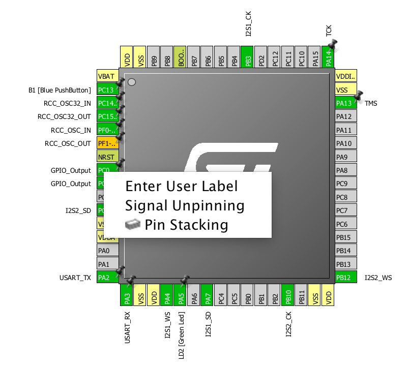
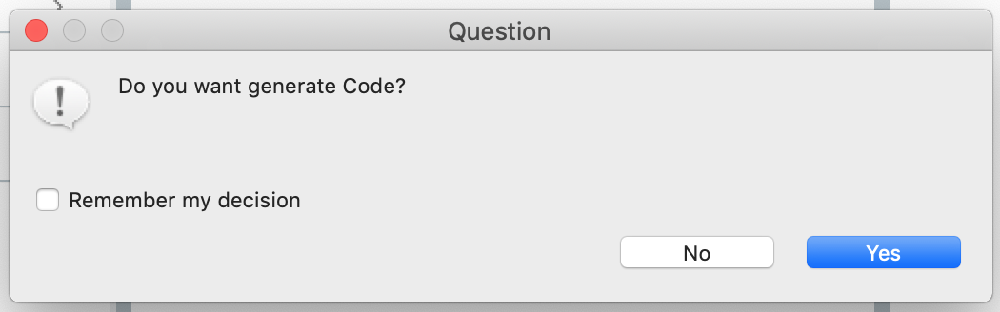

# Setting up the I/O

The initialization code we generated in the [blinking LED example](../../microcontroller/test_project.md) will need to be updated as it does not perform the setup for the two I2S buses that we will need to communicate with the microphone and the DAC.

## Create a new project

First_**,**_ let's make a copy of our working LED blinking project. We want to keep tracks of old projects in order to be able to go back to a known working configuration if something is not functioning anymore. To copy the project use the "Project Explorer" of the SW4STM32 software. Open the project you want and do a simple copy/paste operation. When you paste the project, a pop-up will ask you the rename the copied project: we recommend choosing a name that includes the current date and the word "passthrough" in it for bookkeeping purposes. 

To finish the copying process:

* make sure that the binary file of the original project is removed by deleting the `.elf` file in the `Binaries` folder of the new project.
* rename the .`ioc` file with the name of the project

Now we are ready to update the initialization code. From the project explore, click on the `IOC` file of the new project and open the CubeMX configurator.

## Enable and configure the I2S buses 

When the `IOC` file has successfully loaded, you should see something similar to the figure below. On the left-hand column, select "Multimedia" and expose the **I2S1** and **I2S2** selectors.

### I2S1 \(DAC\)

Let's begin by setting up the I2S channel that communicates with the DAC. Click on I2S1 and select the "Half-Duplex Master" for the Mode in the top middle panel.

You should see several pins highlighted in green: after enabling an I2S bus, the interface shows in green the electrical pins in the microcontroller that will be devoted to the signals used in the I2S protocol. Recall that an I2S bus uses three pins according to the [I2S specification](https://www.sparkfun.com/datasheets/BreakoutBoards/I2SBUS.pdf):

1. Clock \(**CK**\).
2. Word select \(**WS**\).
3. Serial data \(**SD**\).

Move your attention now to the "Configuration" panel below; we'll need to set up the structure of the data that transits on the bus \(bits per word and per frame\) and the data rate.

Select the "Parameter Setting" tab and set the transmission mode to "Mode Master Transmit" and the Communication Standard to "I2S Philips".

Now let's configure the DMA transfers. Select the "DMA Settings" tab and press "Add". Adjust the settings so that DMA Request is set to "SPI1\_TX, Data Width is set to "Half Word" and Mode is set to "Circular", as in the screenshot below. Note that the DMA stream can differ if you are using a different microcontroler as it is dependent on the physical implementation of the internal circuitry.


TASK 1: Finish the set up for I2S1 so that it can be used to communicate to the DAC by setting the Data and Frame Format and the Audio Frequency. You will have to check the [DAC datasheet](https://www.nxp.com/docs/en/data-sheet/UDA1334ATS.pdf) in order to find the correct parameters \(sampling frequency, data and frame format\).


### I2S2 \(microphone\)

Repeat the previous steps for I2S2 with the following differences:

* set the Transmission Mode to "Mode Master Receive"
* set the DMA request to "SPI2\_RX

Finally, complete the configuration:


TASK 2: Finish the set up for I2S2 so that it can be used to communicate with the microphone by setting the Data and Frame Format and the Audio Frequency. You will have to check the [microphone datasheet](https://cdn-shop.adafruit.com/product-files/3421/i2S+Datasheet.PDF) in order to find the correct parameters \(sampling frequency, data and frame format\).

_Hint: make sure that the DAC and the microphone have the same "Selected Audio Frequency" while satisfying the specifications detailed on the datasheets! An audio frequency below the specified limits will most likely result in_ [_aliasing_](http://www.dspguide.com/ch3/2.htm)_._


As a final sanity check, click on "NVIC" under "System"  in the left column and ensure that the interrupts are enabled for both selected DMA channels, as below.

## Configure the GPIO pins 

The configuration we have done so far would be sufficient in order to create an audio passthrough. However, we will configure two more pins of the microcontroller so that we can programmatically:

1. Mute the DAC.
2. Assign the microphone to the _left_ or the _right_ channel.

Go back to the "Pinout" tab, as seen below.

By clicking on any of the pins, you should be able to see the different functions that particular pin can assume, see below.

We are interested in using two pins as "GPIO\_Output" \(GPIO stands for "General-Purpose Input/Output"\) in order to output a _HIGH_ or _LOW_ value to the Adafruit breakout boards. Set the pins "PCO" and "PC1" to "GPIO\_Output" \(see below\). _You can reset a pin to having no function by selecting "Reset\_State"._

Just as in the case of variables in a program, we should give meaningful names to our GPIO pins. We will rename "PC0" and "PC1" as "MUTE" and "LR\_SEL" respectively. You can rename a pin by right-clicking it and selecting "Enter User Label" \(see below\).

## Update initialization code 

If you now save the `IOC` file \(or if you change perspective\) the source code will be updated:

If you have any of the source files open on SW4STM32, they should refresh automatically to reflect the settings you have changed in CubeMX. Remember that this is why you should not add or modify any section in the code outside of the `USER CODE BEGIN` and `USER CODE END` comments; outside of these tags, all code will usually replaced by a change in configuration.

With the peripherals and initialization code updated, we can proceed to [wiring the breakout boards](wiring.md)!

## Tasks solutions



Are you sure you are ready to see the solution? ;\)



The **transmission mode** is defined by the fact that the peripheral is a DAC, thus the I2S internal peripheral of the micro-controller will have to transmit data to the DAC. The mode to select is then "Master transmit".

The **communication standard** can be either "I2S" or "LSB-justified" as shown in section 1.2 of the [datasheet](https://www.nxp.com/docs/en/data-sheet/UDA1334ATS.pdf), we will then choose "I2S Phillips" as it is the default value selected when SF0 and SF1 of the breakout are not connected.

The second paragraph of section 3 of the datasheet says:   
  
_The UDA1334ATS supports the I2S-bus data format with word lengths of up to 24 bits and the LSB-justified serial data format with word lengths of 16, 20 and 24 bits._ 

In the code, we will be using 16-bit samples, so the word size is 16 bit. It is not so clear what it's meant by "frame" in this context, since the term is not part of the [original I2S specification](https://www.sparkfun.com/datasheets/BreakoutBoards/I2SBUS.pdf). Nevertheless, we assume that, since the word size could be up to 24 bit, we should choose a "frame" of 32 bits. This is confirmed experimentally in the sense that, if we choose a frame of 16 bits, the passthrough does not work. You could also test both parameter and control with a logic analyzer what is the frame length. Such type of missing information is often encountered when reading a datasheet.

Lastly, the **Audio frequency** have to be defined. It is important to keep in mind that a faster sampling frequency implies less time for the micro-controller to process each sample. On the other hand, a slow sampling frequency impacts the quality of the signal as it reduces its bandwidth.  
  
The pin called "PLL0" is set to 0 by default \(according to the [schematic](https://cdn-learn.adafruit.com/downloads/pdf/adafruit-i2s-stereo-decoder-uda1334a.pdf?timestamp=1570708179)\), which means that the chip is in _audio mode._ Section 8.1.1, explains that in this mode the pin "PLL1" selects for audio frequency from 16 to 50 kHz \(PLL1 = LOW\) or from 50 to 100 kHz \(PLL1 = HIGH\). In this breakout, PLL1 is set to LOW according to the [schematic](https://cdn-learn.adafruit.com/downloads/pdf/adafruit-i2s-stereo-decoder-uda1334a.pdf?timestamp=1570708179). In order to make our final choice we will chose 32 kHz, this choice will be confirmed by task 2.



The **transmission mode** is defined by the fact that the peripheral is a microphone, thus the I2S internal peripheral of the micro-controller will have to receive data form the microphone. The mode to select is then "Master Receive".

The **communication standard** is "I2S" or "LSB-justified" as shown in first paragraph of page 7 of the [datasheet](https://cdn-shop.adafruit.com/product-files/3421/i2S+Datasheet.PDF), we will then choose "I2S Phillips" like done for I2S1.

This datasheet gives more information about the **Data and Frame format**. We will chose the same parameter as for I2S1 but figure 7 of the datasheet shows us that the frame is 32bits and that the microphone will send 18 bits with the actual value, then 6 of 0 state and then 8 of tri-state. We will chose "16 Bits Data on 32 Bits Frame" in order to use 16Bits variable and have a faster processing.

The **Audio frequency** have to be defined. This device is a bit more restrictive that the DAC. Indeed in page 7 of the datasheet we can read the following: _Clock frequencies from 2.048Mhz to 4.096MHz are supported so sampling rates from 32KHz to 64KHz can be had by changing the clock frequency._ In this case we clearly see that a frequency slower than 32kHz will theoretically not work properly.



