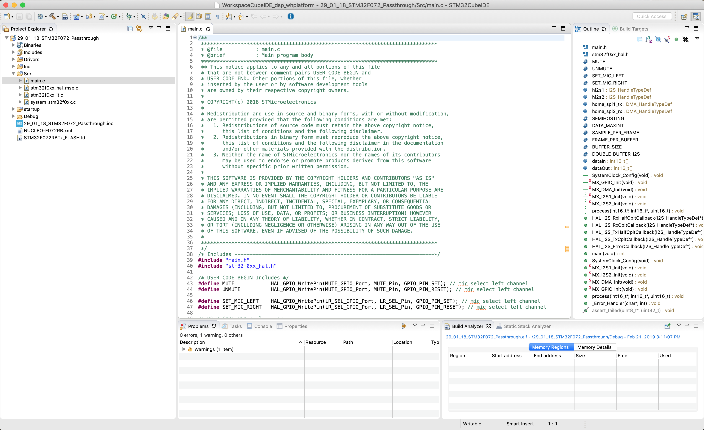

# STM32 Cube IDE

The ST Nucleo board hosts a microcontroller that is both:

* highly _configurable_, in the sense that some of its electrical pins can be rerouted in software and assigned to specific function
* _programmable at a high level,_ since we can use C code and use a compiler to produce the microcode that will be uploaded onboard

To handle this great flexibility, ST provides us with an integrated development environment \(IDE\) that we can use to manage both aspects of Nucleo programming. This is the [**STM32CubeIDE**](https://www.st.com/en/development-tools/stm32cubeide.html)**,** an Eclipse-based IDE for programming STM32 microcontrollers. From the description webpage:

> STM32CubeIDE is an all-in-one multi-OS development tool, which is part of the STM32Cube software ecosystem. STM32CubeIDE is an advanced C/C++ development platform with peripheral configuration, code generation, code compilation, and debug features for STM32 microcontrollers and microprocessors. It is based on the ECLIPSE™/CDT framework and GCC toolchain for the development, and GDB for the debugging.

The IDE includes a chip configuration graphical interface called CubeMX:

and an Eclipse-based programming environment:

## Installation

_Note: these instruction and images were produced on October 1, 2019._

The following steps are the same for Windows, Linux, and MacOS and they simply consist of downloading the installation files.

### Download instructions

Please refer to the distributor website for detailed installation instructions. Please refer to the corresponding subsection after the following instructions for our additional remarks.

1\) Go on [ST official download page](https://www.st.com/en/development-tools/stm32cubeide.html) with your favorite browser.

2\) Select the download link according to your operating system.

4\) You will be asked to log-in in order to continue with the download; please create an account and follow the instructions.

5\) When you will have completed the log-in, the download will normally start.

6\) Open the installer and follow the steps. You need to perform a standard installation. Some driver will also be installed during the process. Don't skip this, otherwise you will not be able to download your code into the microcontroller.

[Here](tips.md), we provide some useful shortcuts tips when working with Eclipse-based tools like SW4STM32.

### Specific instructions for MacOS

_Note: the instructions were tested using MacOS Mojave, Version 10.14 on October 1, 2019._

You may encounter the following dialog on macOS, please follow the instructions below if it is your case.

1\) Open your _System Preferences_ and navigate to _Security & Privacy_

2\) In the _General_ tab, click _Open Anyway_

