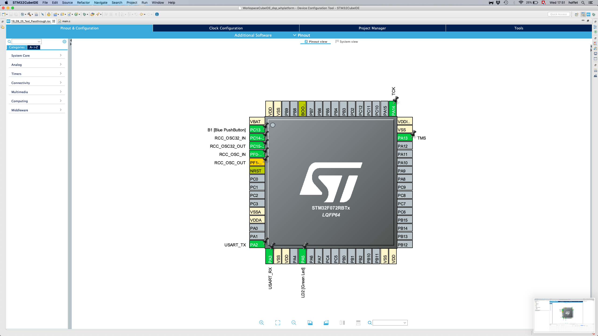
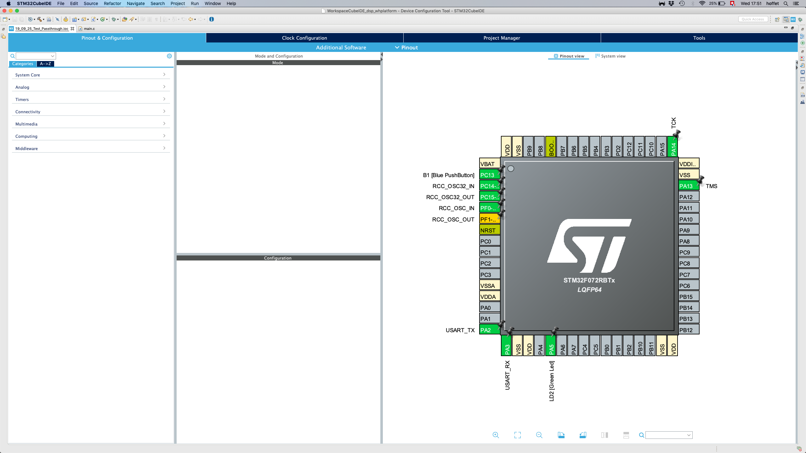
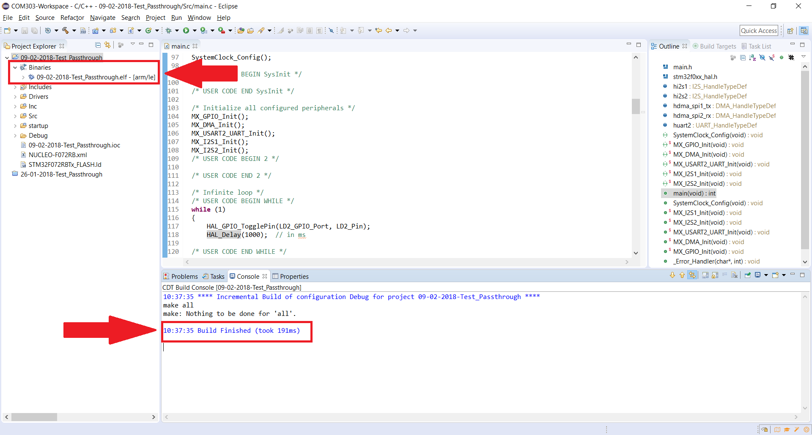
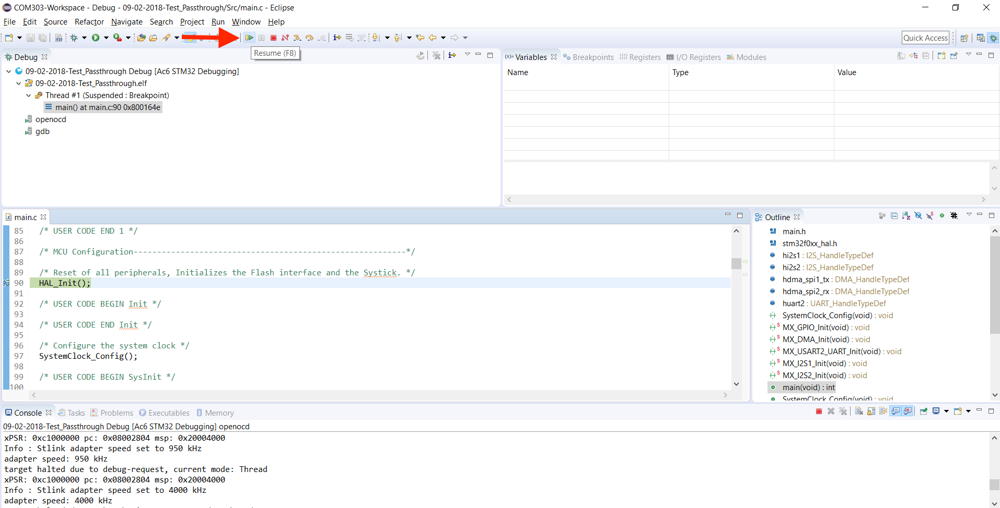
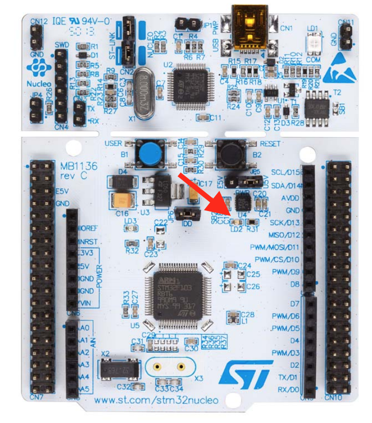

# A simple test project

In this section we will guide you step by step through the process of coding a simple application for the microcontroller, connecting the board, and running the application on the microcontroller. This first application does not use any peripherals and simply makes an onboard LED blink, it will be a basic project template that we can reuse many times later.

Please note that, if you get stuck, you can always download the working STM32 projects for the examples in this gitbook [here](https://github.com/LCAV/mooc-hwlab/blob/master/scripts/hwlab.zip).

## Open the IDE and select a workspace <a id="init_code"></a>

1\) Open the STM32CubeIDE that you just installed in the previous section.

2\) Select a workspace, this will be the folder where all project are going to be stored. You can create multiple workspaces if you work on different projects.


3\) Once you select a valid folder you can Launch the IDE.


## Create a new project <a id="init_code"></a>

The first time you open the software, you will be prompted by the screen shown below. If a pop-up appears, asking if you would like to initialize all peripherals with their default mode, simply press _Yes_.


Press the _Start new STM32 project_ button in order to launch CubeMX and start initializing the project.

If you have a workspace that already contains project, the _new project button_ is in the top left corner.

## Configuring the hardware with CubeMX <a id="init_code"></a>

We will be using CubeMX's graphical interface to generate the initialization steps for the board and its peripherals. Once the board is configured, the IDE will translate our configuration choices into automatically-generated _C_ code.

### Board selection

When all necessary downloads are completed, you should eventually see something similar to the screenshot below. Click on the _Board Selector_ tab in the top toolbar to the left.


Make sure the "Board Selector" tab is the active one \(top-left corner\) and look for our board, the "NUCLEO-F072RB" \(you can use the "Part Number Search" facility\). Double-click the board in the search results. Note that if you are using a different ST board that [fulfills the requirements for our projects](../bill-of-materials.md), you should select the model you actually have.


Chose an appropriated name for the project, including the date, project goal etc, and leave the options as default.


When clicking next, you will see a pop-up asking if you want to initialize all peripherals to their default mode: this applies to the external circuits that may have been added to the Nucleo board. Peripheral initialization will be relevant later, when we add a microphone and an audio output module, but in this case we are only using an onboard LED and a button. Press _Yes_ in any case.


When the board has loaded, you should see something similar to the following screenshot:



Extend the central pane if it was hidden, because it will be needed later!



### Code generation

When a Nucleo template is selected and all peripheral initialized to their default values, the blue button _B1_ and the LED _LD2_ are already configured; this is sufficient for our first project.

We are now ready to generate the initialization code. Save your project by pressing _CTRL+ S_. The project will be automatically generated if a modification was made; in this case, since we did not change the layout, you may have to trigger the code generation by pressing _Alt + K_. _CubeMX_ will generate some C files, using _HAL_ libraries, that encode all the settings that was selected via the GUI.

_HAL_ is short for _Hardware Abstraction Layer_ and it is a set of libraries provided by ST to help developers produce _portable_ code, i.e. code that can be used across the whole family of STM32 boards. For more information on HAL, please refer to [this document](https://www.st.com/content/ccc/resource/technical/document/user_manual/2f/77/25/0f/5c/38/48/80/DM00122015.pdf/files/DM00122015.pdf/jcr:content/translations/en.DM00122015.pdf).


## The user application  <a id="deploy"></a>

From the "Project Explorer", open the file `"Src/main.c"`; this is the code automatically generated by CubeMX and it will look like so:


If you look at the C code, you can notice matched commented lines that read `USER CODE BEGIN` and `USER CODE END`; _**it is only between these tags that you should write your code!**_

All other lines of code have been generated automatically by CubeMX according to the configuration we specified via the graphical tool. If you go back and change some of the configuration parameters, CubeMX will overwrite all the code that is not between the `USER CODE` tags!

### Blinking an LED

We will now program the board to perform a simple task - make an onboard LED blink!

In the code, look for the infinite loop between the comments `USER CODE BEGIN WHILE` and `USER CODE END WHILE`, add the following lines to the body of the loop:

```c
/* Infinite loop */
/* USER CODE BEGIN WHILE */
while (1) {
    HAL_GPIO_TogglePin(LD2_GPIO_Port, LD2_Pin);
    HAL_Delay(1000);  // in ms
/* USER CODE END WHILE */

/* USER CODE BEGIN 3 */

}
/* USER CODE END 3 */
```

`HAL_GPIO_TogglePin` and `HAL_Delay` are commands provided by the ST HAL library for toggling the voltage level on a pin and to pause execution, respectively. Remember that you can always look for the definition of a function or of a variable by pressing _Ctrl_ and clicking the function/variable.

The first command toggles the value of the pin corresponding to the LED at pin _LD2_; this turns the LED _on_ for one iteration of the while loop and _off_ for the next iteration. In order to actually being able to observe the LED blinking we must set a delay between each toggle operation, otherwise the blinking would be too fast to be perceived. This is what the second command accomplishes by placing a delay of 1 second; the argument of the function `HAL_Delay` is indeed in milliseconds.

### Building the project

Before plugging in the board, let's try building the project. This can be done by pressing the _hammer_ icon on the top toolbar, or by using the shortcut Ctrl + B \("Command + B" on MacOS\). Make sure you are building for the _Debug_ target and for the correct project.

In the figure below, we can see the two signs of a successful build:

* A "Binaries" folder was created, as can be seen in the "Project Explorer", and it contains an ELF file corresponding to our project. It should have the same name as your project. If this does not appear, it may be necessary to refresh the project by right-clicking the project directory and selecting _Refresh_ \(or using the shortcut F5\).
* There are no errors in the "Console" pane.



Now we can program the board! Plug the board to your computer using the USB Type-A to Mini-B cable. A couple LEDs of the board should light up as it is being powered by your computer.

### Debugging the code

Click on the _bug_ icon from the toolbar and select _Debug As &gt; STM32_ MCU _C/C++ Application_ \(see below\).


If there are no debug configurations available from the menu, set up a configuration first by choosing "Debug configurations..." and clicking on the STM32 Cortex-M option. 

If this is your first time debugging in this workspace, you should see a pop-up similar to the one below appear. Click "Yes" as this perspective will be very useful, and you can check the box for "Remember my decision" so that this pop-up does not appear again.


If something similar to the following error appear:

```text
"Unplugged target or STLink already in use or STLink USB driver not installed."
```

make sure the board is properly plugged in and/or try another USB port.

If the Nucleo's firmware is outdated, you might be requested to update it by the following po-up:


Just press _OK_ and then _Yes._


When the Nucleo is reconnected. First press _Open in update mode,_ and then _Upgrade_ the firmware of your Nucleo.


After the upgrade, you can press again on the bug button to resume debbuging.

A view similar to the one below should then appear. This is the typical "Debug perspective" in Eclipse.



Your program should be momentarily paused as is the case in the figure above at Line 90. You can continue the program by pressing the _Resume_ button as pointed out above.

You should now observe the green "LD2" LED \(see below\) blinking!



_Figure: Top view of a NUCLEO board. Red arrow pointing out the location of "LD2" LED._ [Picture source](https://www.st.com/content/ccc/resource/technical/document/data_brief/c8/3c/30/f7/d6/08/4a/26/DM00105918.pdf/files/DM00105918.pdf/jcr:content/translations/en.DM00105918.pdf).

### Terminating the program

In order to properly stop the debugger, it is also necessary to disconnect from the board. Both can be done by pressing the _Disconnect_ button on the top toolbar \(see below\).


Finally, you can switch back to the _normal_ perspective by pressing the button to the left of the _bug_ icon in the top-right corner \(see below\).


