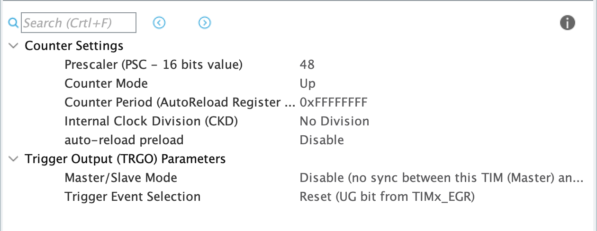

# Benchmarking

When discussing the code architecture of a generic real-time audio device, we already remarked that if our processing callback is too slow with respect to the frequency of the DMA transfers, we will run into a condition called buffer underflow \(or overflow, if you look at it from the point of view of the input DMA\).

It's therefore very important to make sure that our processing is fast enough and find out if and where the code is using up a lot of time. Fortunately, the microcontroller provides us with functionalities that gives the possibility to monitor that.

## Timers <a id="benchmarking"></a>

The `HAL` library includes a function `uint32_t HAL_GetTick(void);` which will return the number of ticks since the start of the microcontroller in milliseconds. Unfortunately we cannot use this tool because a resolution of one millisecond is too large for most audio sampling frequencies. For instance, with $$F_s = 32$$MHz the period to perform one operation is$$T_s = 31.25 \mu\textrm{s}$$, thus the micro-second granularity is way too slow.

In order to have a finer timebase, we will use the Nucelo's onboard [timer](https://www.embedded.com/electronics-blogs/beginner-s-corner/4024440/Introduction-to-Counter-Timers), whose full technical details can be found [here](http://www.st.com/content/ccc/resource/technical/document/application_note/group0/91/01/84/3f/7c/67/41/3f/DM00236305/files/DM00236305.pdf/jcr:content/translations/en.DM00236305.pdf). Briefly, all computing boards \(and microcontroller are no exception\) possess an internal clock that provides a reference timebase signal; this timebase is usually generated by a [crystal oscillator](https://en.wikipedia.org/wiki/Crystal_oscillator). The onboard timer is a roll-over counter that is incremented in lockstep with the timebase signal, often via a [prescaler](https://en.wikipedia.org/wiki/Prescaler) that can be used to lower its frequency, since the oscillator is usually very fast.

For our application, we will use a timer with a large counting capacity \(32 bits\) and we will set it to increment itself every microsecond.

## Setting up the timer <a id="timer"></a>

To set up the timer we will use CubeMX and then regenerate the initialization code. Open the CubeMX file by double clicking the `.ioc` file of the copied project it in the IDE project explorer.

In order to activate a timer, you need to set a "Clock Source". Open _TIM2_ in the Timers menu \(_TIM2_ happens to be 32bit timer\) and activate its clock by setting the Clock Source to "Internal Clock".


Next, we need to configure the timer in the configuration panel that appears:



TASK 1: Set the Prescaler value \(in the figure above\) in order to achieve a $$1\,\mu s$$ period for "TIM2", i.e. we want our timer to have a$$1\,\mu s$$resolution.

_Hint: Go to the "Clock Configuration" tab \(from the main window pane\) to see what is the frequency of the input clock to "TIM2". From this calculate the prescaler value to increase the timer's period to_ $$1\,\mu s$$_._


Set the Counter Period to `0xFFFFFFFF`; this ensures that the 32-bit timer counter only rolls around at its maximum value. You can leave the rest of the parameters as is for "TIM2". Finally, you can update the initialization code by saving the `.ioc` file.

## Using the timer

In order to use the timer we configured, we will define a couple of macros to start and stop the timer and a global variable to keep track of the time that elapses between calls. Between the `USER CODE BEGIN PV` and `USER CODE END PV` comment tags, add the following lines. Note the `volatile` declaration for the timer, which underscores how this variable is a global variable modified by an interrupt service routine independently of the normal control flow of the rest of the code.

```c
/* USER CODE BEGIN PV */
volatile int32_t timer_value_us;

#define START_TIMER {\
  HAL_TIM_Base_Init(&htim2);\
  HAL_TIM_Base_Start(&htim2); }

#define STOP_TIMER {\
  timer_value_us = __HAL_TIM_GET_COUNTER(&htim2);\
  HAL_TIM_Base_Stop(&htim2); }
```

For instance, to benchmark the passthrough example, we can modify the Process function like so

```c
void inline Process(int16_t *pIn, int16_t *pOut, uint16_t size) {
  START_TIMER

  ... // passtrhough code here

  STOP_TIMER
  // at this point the variable timer_value_us will contain
  //  the number of microseconds used by the portion of code
}
```

## Benchmarking live

In a real-time audio application the processing time cannot exceed the time between successive DMA calls; if this is not the case, we have a so-called buffer underflow which results in extremely corrupted audio. We will use our benchmarking timer to make sure we are within the limits.


TASK 2: In the passthrough example, the macro `FRAMES_PER_BUFFER`determines the length of the DMA transfer. In our code, we set this length to 32 \(stereo\) samples.

What is the maximum processing time that we can afford in this case?

What if we change the value to 512 samples?


To check the actual time used by our processing function we will use an extremely convenient facility provided by the STM32 IDE, namely the possibility to monitor the live value of the variables in our code while the code runs.

Pull up the passthrough example and modify the processing function as shown in the previous section by inserting the START\_TIMER and STOP\_TIMER macros. Then launch the application in the debugger.

In the debugging window in the top right corner of the screen, select the "live variables" tag and add the variable timer\_value\_us.


You can see that the passthrough code takes about 33 microseconds to execute, which is well below the maximum available time. This is good news!

## **Solutions**



Are you ready to see the answer? :\)



As proposed in the hint, if you go to the tab _Clock Configuration_ of CubeMX, you will see the following graph:


Note the last block on the right column _APB1 Timer clocks \(MHz\):_ 48. It means that your timer is "driven" by a base tick frequency of 48MHz. in order to reduce this to $$1 \, \mu s$$or in other word 1 MHz, you will have to divide it by 48. This number is thus your prescaler. This leads to the following timer configuration:



Note the _Counter Period_, it is the value where the interrupt is triggered, here it is set to the maximum value.



The time between DMA calls for a sampling frequency $$F_s$$and a buffer of $$N$$samples is

$$
t_{\max} = 10^6\, N/F_s \ \mu s
$$

Since the audio peripherals are working at 32 KHz, the time between DMA calls for a buffer of 32 samples is 1000 $$\mu s$$ \(i.e. one millisecond\)

For a buffer of 512 samples, the maximum processing time is 16'000 $$\mu s$$.



