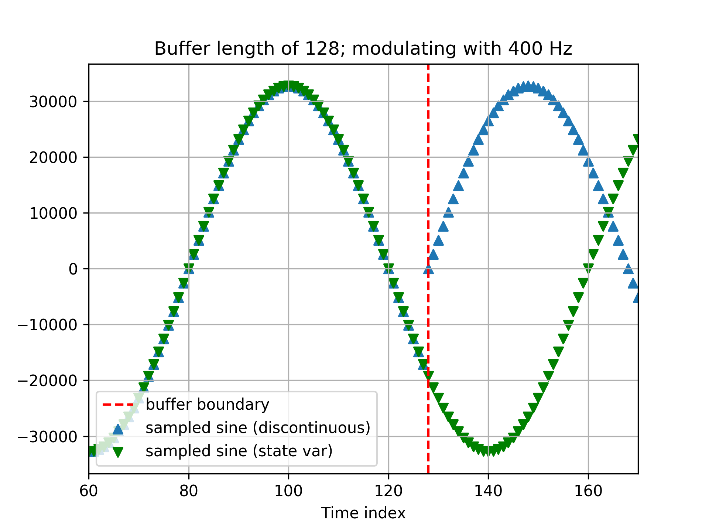

# Code efficiency

Coding a "real-world" DSP application on dedicated hardware is a bit of a shock when we are used to the idealized world of theoretical derivations. In this section we will review some of the most common issues that we have to keep in mind.

## float vs. int <a id="float"></a>

Operations with `float` variables can take significantly more time than the same operations with `int` variables. For our application, we noticed that an implementation with `float` variables can take up to 35% more processing time! Therefore, we recommend avoiding `float` variables whenever possible!

Real numbers can be mapped to integers via renormalization when we can estimate the maximum range; for instance, a floating point value between -1 and +1 can be mapped to a 16-bit integer via a scaling factor of $$2^{15} = 32768$$yielding 65535 discrete levels.

Remember that when you multiply two $$B$$-bit integers the result will need to be computed over a $$2B$$-bit integer to avoid overflow. The result can be rescaled to $$B$$bits later, but try to keep rescaling to the end of a chain of integer arithmetic operations all of which are carried out with double precision. 

In other words, since we're working with 16-bit samples, we will perform the intermediate arithmetics that involve multiplications using 32-bit variables, and then we will shift back the result to 16 bits.

With an intelligent use of operation priority, integer arithmetic will not unduly impact the performance of our algorithms.

More about these kinds of trade-off can be read [here](https://www.embedded.com/design/debug-and-optimization/4440365/Floating-point-data-in-embedded-software) and [here](https://en.wikibooks.org/wiki/Embedded_Systems/Floating_Point_Unit).

## Circular buffers

In [Lecture 2.2.5a](https://www.coursera.org/learn/dsp2/lecture/6oXrx/2-2-5-a-implementation-of-digital-filters) in the [second DSP course](https://www.coursera.org/learn/dsp2/) we discussed some implementation issues related to discrete-time filters and, in particular, we talked about circular buffers. 

As a quick recap, remember that if you need to store past vaues of a signal, the best solution is to use a circular buffer; assume that you need to access at most $$M$$past values of the signal $$x[n]$$:

* set up an array `x_buf[]` of length$$M$$\(ofthe appropriate data type\)
* set up an index variable `ix`, initialized at zero
* every time you receive a new sample, store it in the array at `ix` and increment `ix` modulo $$M;$$

with this, the expression $$x[n-k], k <M,$$can be accessed as `x[(ix + M - k) % M]`.

In a microcontroller, where each CPU cycle counts, modulo operations are expensive but they can be avoided and replaced by binary masks if we choose $$M$$to be a power of two. In those cases, `ix % M` is equivalent to `ix & (M-1)` and the bitwise AND is a much faster operation. Since $$M$$is the _minimum_ number of past values that we need access to, we can always increase $$M$$until its reaches a power of two, especially when $$M$$is small.

Here is a simple example:

```python
#define BUF_LEN 16
#define BUF_MSK 15 /* binary mask is always len - 1 */
uint16_t x_buf[BUF_LEN];
uint16_t ix = 0;

/* storing sample x */
x_buf[ix++] = x;
ix &= BUF_MSK;

/* accessing x[n-k] */
uint16_t x_k = x_buf[(ix + BUF_LEN - k) & BUF_MSK];
```

## Sinusoidal lookup tables <a id="lookup"></a>

Most signal processing algorithms require the use of sinusoidal functions. In a microcontroller, however, computing trigonometric values for arbitrary values of the angle is an expensive operation since it always involves some form of Taylor series approximation. Even using a few terms, as in

$$
\cos x = x - \dfrac{x^2}{2!} + \dfrac{x^4}{4!} - \dfrac{x^6}{6!} + \mathcal{O}(x^8)
$$

clearly requires a significant number of multiplications. A computationally cheaper alternative is based on the use of a [lookup table](https://en.wikipedia.org/wiki/Lookup_table). In a lookup table, we precompute the sinusoidal values that we need and use the time index $$n$$simply  to retrieve the correct value. 

In sinusoidal modulation we need to know the values of the sequence $$\cos(\omega_c n)$$ for all values of $$n$$. However, if $$\omega_c$$is a rational multiple of $$2\pi$$, that is, if $$\omega_c = 2\pi(M/N)$$for $$M,N \in \mathbb{N}$$, then the sequence of sinusoidal values repeats exactly every $$N$$samples. 

For instance, assume the input sampling frequency is $$F_s = 32$$KHz and that our modulation frequency is $$f_c = 400$$Hz. In this case $$\omega_c = 2\pi /80$$and therefore we simply need to precompute 80 values for the cosine and store them in an array `C[0], ..., C[79]`. The equation

$$
y[n] = x[n] \, \cos(\omega_c n),
$$

becomes simply

```c
y[n] = x[n] * C[n % 80]
```

Of course, we are trading computational time for memory here so, if $$N$$in the denominator is impractically large, the table lookup method may become prohibitive, especially on architectures such as the Nucleo which do not have a lot of onboard memory. Also note that this is one case in which we most likely won't be able to use binary masks instead of modulo operations since the period of the sinusoid is unlikely to be a power of two.

Another difficulty is when $$\omega_c$$is _not_ a rational multiple of $$2\pi$$. In this case, we may want to slightly adjust the modulation frequency to a value for which the rational multiple expression becomes valid.

## State variables <a id="state_var"></a>

All discrete-time signal processing data and algorithm make use of a free "time" variable $$n$$. As we know, in theory $$n \in \mathbb{Z}$$ so its value ranges from minus infinity to plus infinity. In an actual DSP application we are much more likely to:

* start the processing with all buffers empty and with $$n=0$$\(initial conditions\)
* store $$n$$in an unsigned integer variable and increment it at each iteration.

The second point in particular means that, in real time applications that may run for an arbitrary amount of time,  $$n$$will increase until it reaches the maximum positive value that can be expressed by the variable and then roll over to zero. Since we certainly do not want this rollover to happen at random times and since the roll over is unavoidable, we need to establish a strategy to carry it out explicitly.

In practice, all real-time applications only use circular buffer, either explicitly \(to access past input and output values or to access lookup tables\) or implicitly \(to compute the output of functions that are inherently periodic\). As a consequence, we never need the exact value of $$n$$but only the position of a set of indices into circular buffers.

In our code, therefore, we will explicitly roll over these indexes independently and, to make sure all variables are stepped synchronously, we will define them as [static variables](https://stackoverflow.com/questions/572547/what-does-static-mean-in-c) inside our `process` function, since static variables keep their values between consecutive function calls. Such variables are often referred to _state variables_ in C programming.


~~Remember that, as we explained in the~~ [~~implementation of the passthrough~~](../audio-peripherals/passthrough/coding.md#constants)~~, we receive \(and process\) the incoming audio in _buffers_ that consist of multiple _frames_; each frame contains one sample _per channel_. The dimesions are:~~

* ~~buffer size = number of frames per buffer~~
* ~~buffer length = number of~~ 

~~The buffer size is therefore We will refer to the number of frames in each buffer as the "buffer length" and the total number of samples \(as one frame could have multiple samples\) as the "buffer size".~~

~~Imagine that we have 128 frames per buffer and two channels, so the "buffer length" is half the size of the "buffer size". For the first buffer we receive, i.e. the first 128 samples, the voice effect computation is straightforward:~~

$$
y[n] = x[n] \cdot \sin(\omega_{mod} \cdot [n \textrm{ \% LOOKUP_SIZE}]), \quad n \in [0, 127],
$$

~~where~~ $$\textrm{LOOKUP_SIZE}$$ ~~is the number of entries in our lookup table. However, the second and subsequent buffers require us to know the current time index. We **cannot** simply multiply the input signal with~~ $$\sin(\omega_{mod} \cdot [n \textrm{ \% LOOKUP_SIZE}]), n \in [0, 127]$$ ~~at each buffer as this would result in multiplying our input signal with a _discontinuous_ estimate of our sinusoid. In the figure below, we can observe how our input signal could be multiplied with a discontinuous estimate of a sinusoid if information is not passed between buffers. Such an operation would lead to _glitches_ in the output audio, which have a very noticeable "clicking" sound.~~



_Figure: Discontinuous sinusoid estimate \(blue, right-side up triangles\) across consecutive buffers. For the new buffer, the discontinuous estimate simply starts at the beginning of the lookup table rather than continuing along the lookup table \(green, upside-down triangles\)._

One solution would be to keep track of the number of buffers processed thus far so that we could multiply with the appropriate time index as such:

$$
y[128 \cdot B + n] = x[128 \cdot B + n] \cdot \sin(\omega_{mod} \cdot [(128 \cdot B + n) \textrm{ % LOOKUP_SIZE}]), \quad n \in [0, 127],
$$

where $$B$$ is the number of buffers processed so far. Below is the corresponding _pseudocode_ \(do not copy this to Eclipse!\):

```python
B = 0
for k in range(n_buffers):
    for n in range(n_frames):
        y[n] = x[n] * sine_table[(n_frames*B+n)%LOOKUP_SIZE]
    B += 1
```

This works but the range of values $$B$$ could assume is technically unbounded if we never stop processing buffers! It would be more feasible to consider a value that has a limited range of possible values.

A better solution would be to keep track of our current "location", i.e. index, in the sinusoid lookup table. This way, in between buffers we know which is the last index in the lookup table we used so that we can use the appropriate offset in the processing of the new buffer. Below is the corresponding _pseudocode_ for this approach \(do not copy this to Eclipse!\):

```python
sine_pointer = 0
while(True):    # can go "forever" without worrying about the value of our state variable as it will wrap around!
    for n in range(n_frames):
        y[n] = x[n] * sine_table[sine_pointer]
        sine_pointer += 1
        sine_pointer %= LOOKUP_SIZE     # limited to the range [0, LOOKUP_SIZE-1]
```

These values that we keep track of in between buffers, such as a pointer to the lookup table, are commonly referred to as _state variables_. For our applications in C, we recommend using [static variables](https://stackoverflow.com/questions/572547/what-does-static-mean-in-c) for state variables inside the `process` function, as static variables keep their values between consecutive invocations inside a function.

