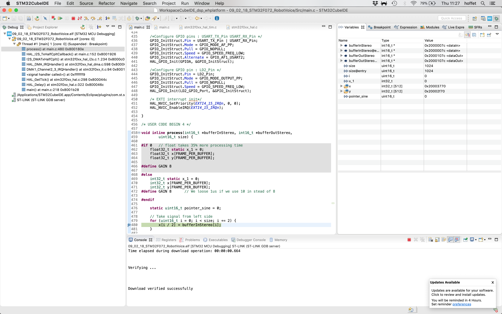
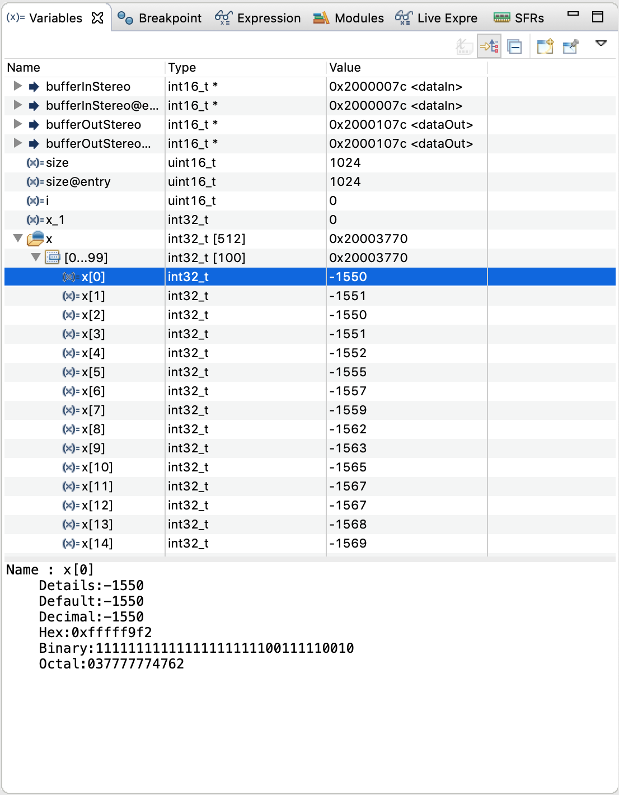
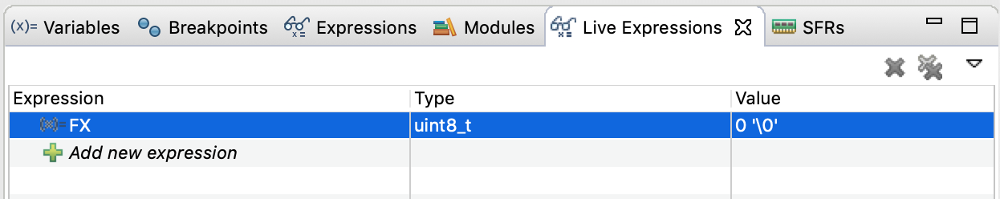
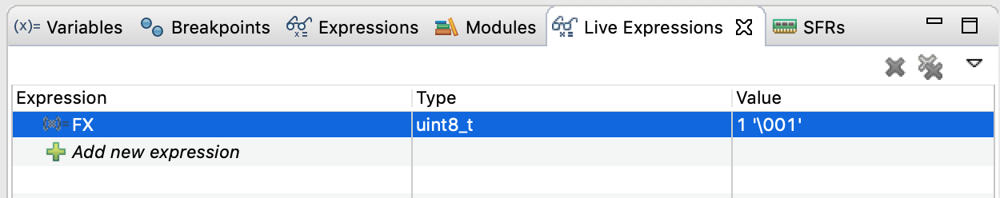
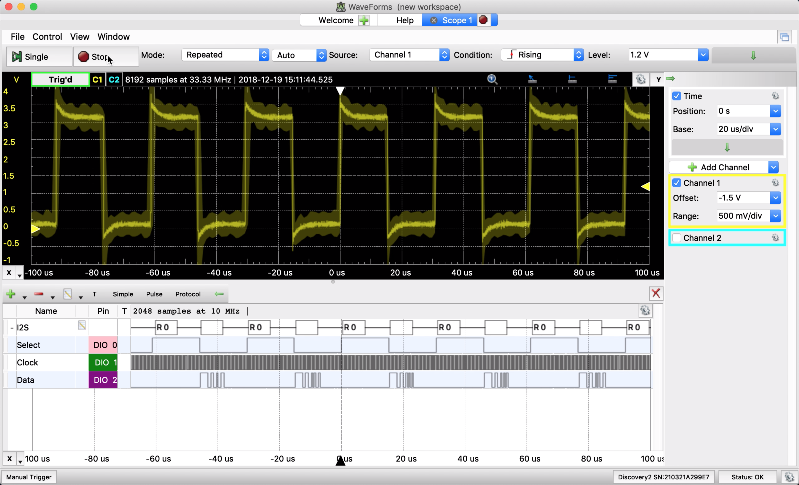
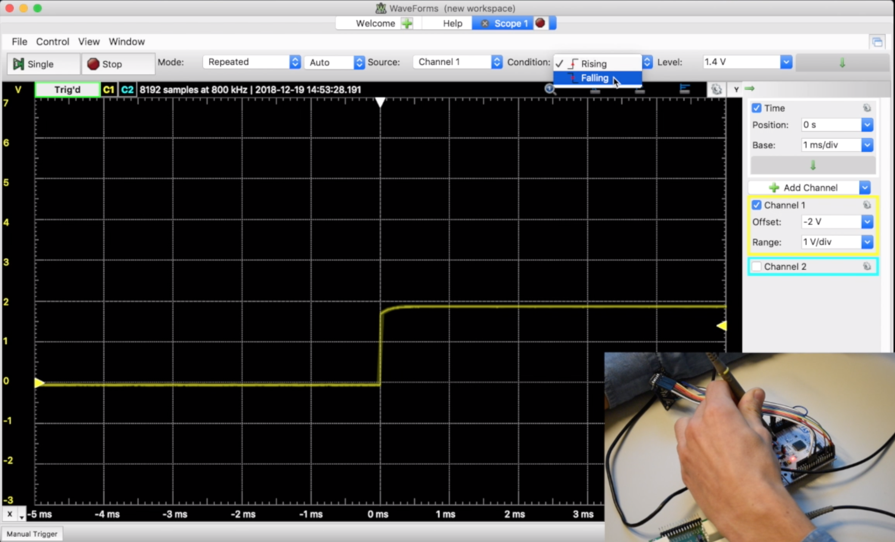

# Low Level Debugging

## Breakpoint and watch

The first and maybe most instinctive way to check if a code is working as expected is to put a breakpoint at a critical line of code. In that way it is possible to check if the micro-controller is going through a certain instruction and do a step-by-step execution of the code starting from the breakpoint.

A breakpoint is added by a double click on a line number in the code window. It can be added either during execution \(debug session already started\) or during editing. When a breakpoint is reached, the view jumps to the breakpoint's line and you will see the following view:

On the previous image you can see several interesting things. Firstly on the left, you can see that the code is currently executing the _process\(\)_ function, you can also see that this process function was called by _HAL\_I2S\_TxHalfCpltCallback\(\)_ and all the hierarchy of function call that lead to this current execution line.

On the center part of the screen you can see the green line, where the microcontroller actually stopped. The current position of the execution can be slightly different from the breakpoint location, particularly if the breakpoint is set on a line that was optimised during the compilation. It can also happen when the compiled code \(assembly code\) is too different from the C code, in such case an instruction can take several cycles to be executed.

Then on the right side, all currently available variables are displayed. The content of the variables are accessible, for example look in the input buffer in the following screenshot:

When the micro controller is stopped, you can either resume, or use the advanced stepping methods to continue the execution of the code.

Be careful, breakpoint can also lead to break the synchronization of your internal peripheral or even lead to serious hazard: Imagine, put a breakpoint in the control loop of a coffee machine, this could lead to stop the system with the heater on and you end up melting the whole thing because the control loop is not active.

For this reason, you might want to watch the internal state of your micro controller without stopping it. Modern IDE usually propose live monitoring. In the case of STM32CubeIDE, there is a _Live Expressions_ tab where you can watch global variables of your program and check their values as we have seen in the [benchmaking section](benchmarking.md#benchmarking-live).

## External tools

When interacting with peripherals that are external to the micro controller, the interaction will either be with digital signals \(like in our case I2S protocol\) or sometimes with analog signal \(imagine if you where reading the analog value of a ambiant light sensor\). In both case you will need to assess that the input and output signals are consistent with what you expect. 

### Oscilloscope

To visualise signals, there usually is two possibilities either a logic analyser or an oscilloscope. Nowadays oscilloscopes tend to also have logic analyser features. An oscilloscope let you visualise a signal and perform measurements on it. For example you can see below an analog signal on top and a logic analyser with the I2S bus on the bottom of the screenshot.

In the past oscilloscope had only 2 signal plotted on an cathodic screen with very few parameter available. Now with digital system and particularly usb oscilloscope the analysis possibilities are endless. We recommend using the [Analog Discovery 2 ](https://analogdiscovery.com/)digital oscilloscope as it gives a lot of IO's at a desreasonable cent price compared to more conventional table top oscilloscopes.

### Trigger setting

The screen of an oscilloscope is displaying the signal over a period of time that can be very short. In the image below, the whole screen is showing only $$200\mu s$$. As the display is continuously updating, one notion is important in order to have a stable display. Most signals that you will watch are somehow periodical. To be able to visualise a very fast changing signal, even with our "slow" brain, the oscilloscope will try to synchronise frames together in order to always print the same part of the signal at the same place of the screen. To do this, the oscilloscope has a trigger setting, it will sense when the signal reaches a certain threshold and it will synchronise all frames to this event. The level of this threshold is set by a dedicated button on table-top machine, and corresponds to the yellow arrow on the right side of the display in our digital oscilloscope. It is possible to set the trigger system to react to a positive or negative slope. On digital analyser, the trigger event can be more elaborated, for example it could be triggered by a particular _start sequence_ of a bus communication.

It is much easier to get an impression of the oscilloscope handling when signals are moving. For this reason we made a video with [more examples that you can find on Coursera](https://www.coursera.org/learn/dsp4/home/week/3).

