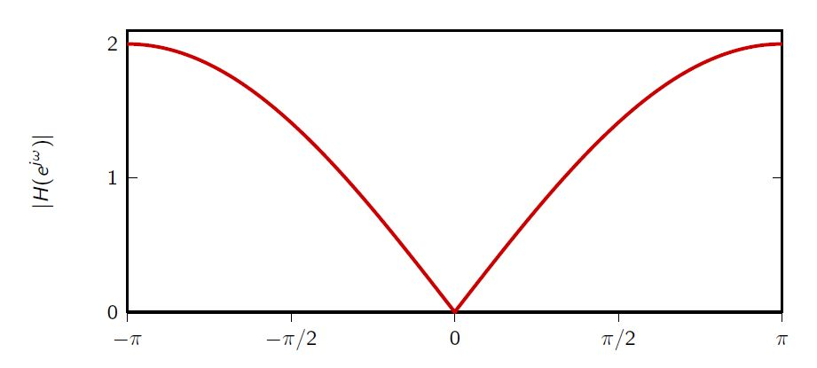
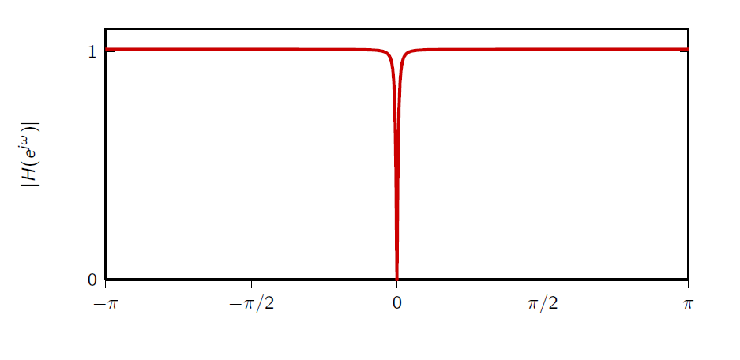
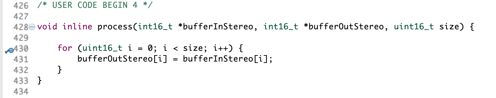
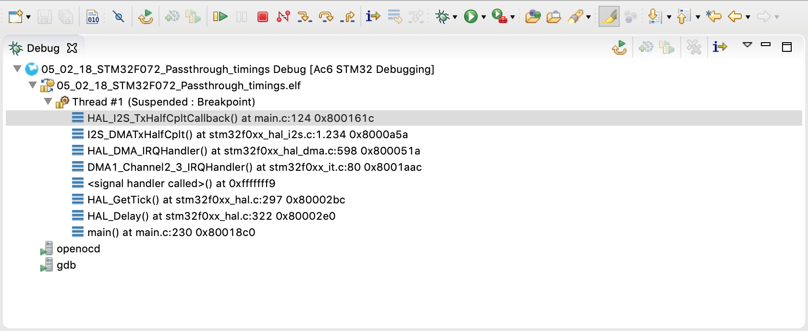

# Signal levels

## Gain <a id="gain"></a>

One thing that you might have noticed from the passthrough example is that the output signal is not very loud. To correct this, we can add a gain factor to the `process`function that multiplies each signal sample by a constant. 

In order to take advantage of the architecture of the microcontroller's internal multiplier, it is recommended to use factors that are a power of 2 since in this case a multiplication corresponds to a simple binary shift of the integer values to the left. We measured$$1\mu s$$difference in processing time when tested with the first voice transformer algorithme.

## Removing the DC offset <a id="removing_dc"></a>

In general, in DSP applications we assume that input signals are zero mean. This is no different in the case of our microphone, so that, if there is no sound, we expect a sequence of zeros. If you actually look at the input samples, however, you will almost certainly find out that this is not so. In fact, the internal circuitry in the microphone almost always adds a voltage offset, and sometimes different microphones \(of the same manufacturer\) will have different offsets. We typically call this shift in the waveform a [DC offset/noise/bias](https://en.wikipedia.org/wiki/DC_bias).

DC offsets are highly undesirable since they limit the dynamic range of our system; in other words, we are "wasting" binary digits on a constant that serves no purpose.


TASK 1: From your passthrough implementation, determine the value of the offset. Is it significant compared to the range of the microphone?

_Hint: put a breakpoint in the process function while being quiet; then with the debug tool, check the content of the input buffer._


We have talked about DC offset removal in [Lecture 2.2.3](https://www.coursera.org/learn/dsp2/lecture/JcNy2/2-2-3-intuitive-iir-designs) in the [second DSP course](https://www.coursera.org/learn/dsp2/). Recall that a DC component corresponds to a nonzero frequency value at $$\omega=0$$so the idea is to use a filter with a zero in $$\omega = 0.$$A very simple example is the so-called FIR "DC notch" whose CCDE is simply

$$
y[n] = x[n] - x[n-1].
$$

Unfortunately this filter has the very poor frequency response shown here and, while good as a first approximation, it is not really recommended if audio quality is important to you.



A better filter is obtained by using a an IIR DC notch which, while marginally more expensive computationally, provides a much flatter frequency response over the audio frequency band:

$$
y[n] = \lambda y[n − 1] + x[n] − x[n − 1]
$$

 When $$\lambda$$is close to \(but less than\) one, we can get a magnitude response like this:




TASK 2: Assume that our input samples are between -1 and +1 and are encoded as signed 16-bit integers. Write a C function that implements an IIR DC notch with $$\lambda = 0.9$$using integer arithmetic.


## Tasks solutions



Are you sure you are ready to see the solution? ;\)





When the code is running, you can double click on any line number to add a breakpoint.

We suggest you to ad a breakpoint at line _430_:



If the micro-controller is connected and a debug session is ongoing, you will see a change in the software and the following list:



It is the hierarchy of the function executed by the micro-controller, indeed main\(\) is the root. Please note that the button _Skip All Breakpoints_ should not be activated for the micro-controller to stop at the given line.


It is then possible to right-click in the editor and press _Add Watch Expression_ you can now enter the name of the variable you want to explore and it will show up in the _Expression_ viewer panel. Unfold the array and you should see something close to this:


Notice that even if the values are fluctuating, the average is around -1540. This is the offset that we where looking for. It is introduced by the microphone and can be variable from one sample to an other.



In the function we will use the key points we saw in the section on [numerical precision](numerical-precision.md#fixed-point-arithmetic):

* performing the multiplication in double precision and rescaling
* since $$x[n]$$and $$x[n-1]$$are usually close in value \(audio signals do not swing wildly\), the chance of overflow in the addition and subtraction is negligible

```c
#define LAMBDA 0x00007999  // (int_32_t)(0.9 * 32768);

static inline int16_t DCNotch(int16_t x) {
  static int16_t x_prev = 0;
  static int16_t y_prev = 0;
  y_prev = (((int32_t)y_prev * 0x00007999) >> 16) - x_prev + x;
  x_prev = x;
  return y_prev;
}
```

The above DC notch is better than the simple one-step difference, but it can be made better with respect to its fixed-point implementation. [Here is an interesting article about that.](https://www.researchgate.net/publication/261775781_DC_Blocker_Algorithms)




