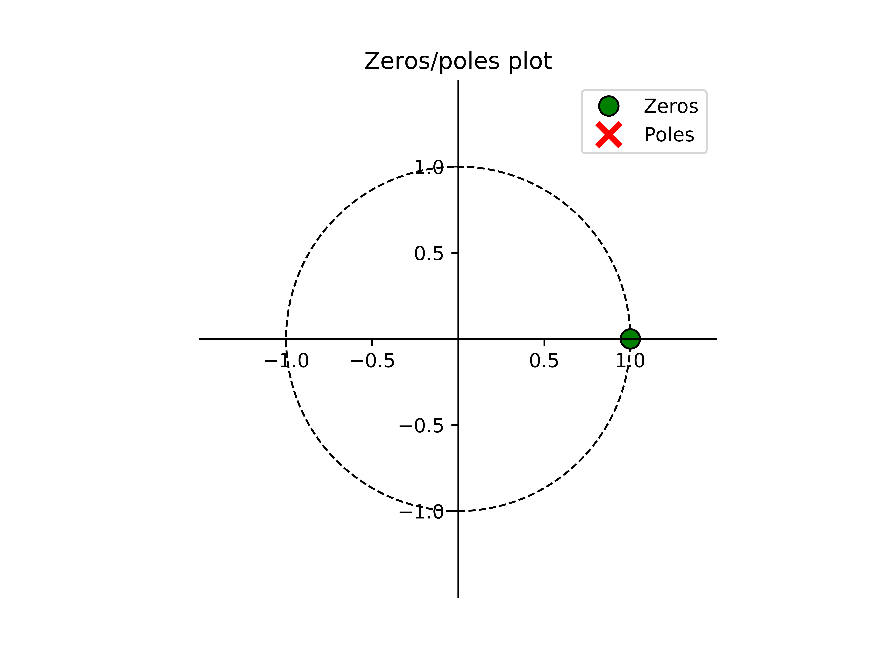
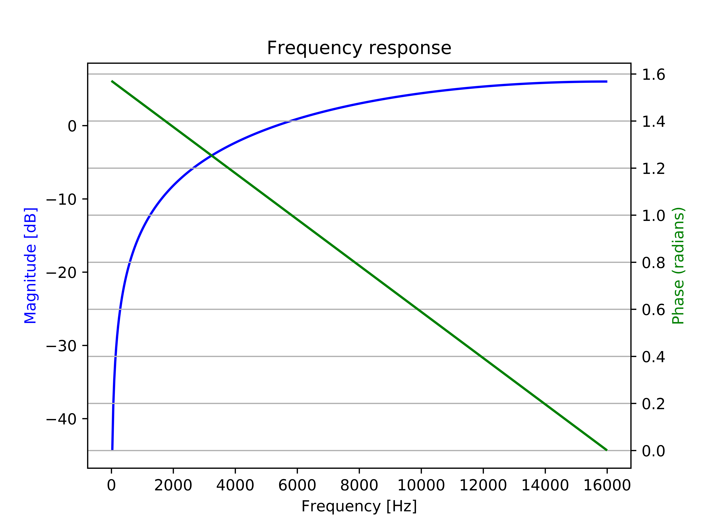

# Signal levels

## Gain <a id="gain"></a>

One thing that you might have noticed from the passthrough example is that the output signal is not very loud. To correct this, we will add a small gain to the `process`function by just multiplying the signal with a constant. In order to take advantage of the architecture of the microcontroller's internal multiplier, it is recommended to use factors that are a multiple of 2 as it is faster to compute. In fact a multiplication by 2 is simply a shift to the left in the "binary world"; similar to how a multiplication by 10 in the "decimal world" is simply adding a 0 at the end.

## Removing DC noise <a id="removing_dc"></a>

Up until now, we assumed that the signal from the microphone is centered around zero, i.e. that no signal corresponds to an amplitude of zero. However, this is not always the case! During audio capture, the internal circuitry in the microphone may add an offset, and sometimes different microphones \(of the same manufacturer\) will have different offsets. We typically call this shift in the waveform a [DC offset/noise/bias](https://en.wikipedia.org/wiki/DC_bias).

For our alien voice effect, a DC offset would result in a constant sinusoid \(at our modulation frequency\) present in the output signal. This is easy to see by adding the DC offset to the signal we saw [before]():

$$
(x[n] + n_{DC}) \cdot \sin(\omega_{mod} \cdot n) = y[n] + n_{DC} \cdot \sin(\omega_{mod} \cdot n),
$$

where $$y[n]$$ are the samples of our desired alien voice effect and $$n_{DC}$$ is the level of the DC noise.


TASK 1: From your passthrough implementation, determine the value of the offset. Is it significant compared to the range of the microphone?

_Hint: put a breakpoint in the process function; then with the debug tool, check the content of the input buffer._


To remove the DC noise, we could simply subtract the average offset of the microphone from every sample. This is a fast solution however, it assumes that the offset is always the same. This may be the case for a single microphone, but imagine calibrating hundreds, thousands, or even millions of microphones! This solution would certainly not scale well.

To avoid calibration we will implement a simple high pass filter. This filter will remove any DC component of the signal, i.e. bin number 0 of the Discrete Fourier Transform \(DFT\). We propose to use a cheap high pass filter of the following form:

$$
y[n] = x[n] - x[n-1].
$$

This type of filter is typically called a [comb filter](https://en.wikipedia.org/wiki/Comb_filter). Equations like above are often referred to as _difference equations_ in DSP. In order to understand the "quality" of a filter, it is often useful to analyze the frequency response of a difference equation by taking its _Z-transform_:

$$
Y(z) = X(z) + X(z) \cdot z^{-1},
$$

from which we can obtain the _transfer function_:

$$
H(z) = \frac{Y(z)}{X(z)} = 1 - z^{-1}.
$$

From such an expression, we can create the standard [pole-zero plot](https://en.wikipedia.org/wiki/Pole–zero_plot) as seen below. With such a plot, we can extract a lot of useful information, such as stability and causality.



_Figure: Pole-zero plot of our simple high pass filter. Thanks to_ [this software](https://www.dsprelated.com/showcode/244.php) _for the visualization function._

For certain system, we can also compute the Fourier Transform, which may be more intuitive to understand. For our simple high pass filter, the frequency response is shown below.



_Figure: Frequency response of our simple high pass filter._

In addition to its simplicity, another good property of this filter is that it has [linear phase](https://en.wikipedia.org/wiki/Linear_phase), which means that each frequency will be delayed by the same amount of time.

It is actually more common to plot the frequency response with the x-axis \(frequency\) in log scale, as shown below.


_Figure: Frequency response of our simple high pass filter \(log scale\)._

With this perspective, we get a better idea of the [filter slope/roll-off](https://en.wikipedia.org/wiki/Roll-off). In this case we have a roll-off of 18 dB/decade, where a decade is 10x increase in frequency. In audio, it is sometime preferred to specify the roll-off in dB/octave, where an octave is 2x increase in frequency. Our simple high pass filter has a roll-off of 5.4 db/octave. See [here](http://www.audiomasterclass.com/newsletter/should-the-slope-of-your-filter-be-6-12-18-or-24-db-per-octave) for a discussion on audio roll-off values.

From the frequency response in the figures above, we can observe how applying this high pass filter will significantly _attenuate_ the DC offset. However, due to the simplicity of our chosen filter we will also attenuate frequencies in our range of interest; the human voice is roughly within the range of 300 Hz to 3400 Hz, see [here](https://en.wikipedia.org/wiki/Voice_frequency). A much _sharper_ filter is certainly more desirable but for the purpose \(and simplicity\) of our exercise this filter will suffice.

Now that we are subtracting the previous sample from the current sample, we will need to introduce another state variable for when we are at the beginning of the buffer. The resulting code is shown below:

```c
// x_1 is the state variable containing the previous sample
for (uint16_t i = 0; i < FRAME_PER_BUFFER; i++) {
    y[i] = x[i] - x_1;
}
```

## Benchmarking implementation <a id="benchmarking"></a>

