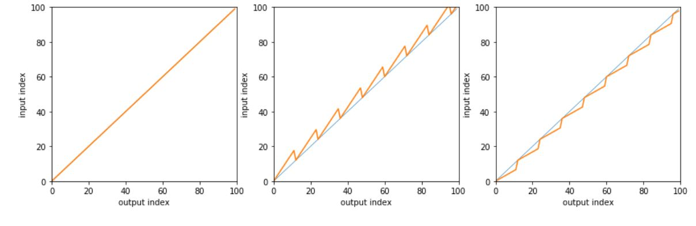

# Granular Synthesis

We will now implement the second voice transformation method described in the Jupyter notebook, namely pitch shifting via granular synthesis. We recommend you study the relevant section on the notebook carefully before proceeding, since the algorithmic details are going to be a bit trickier than what we have seen so far; please make sure you understand the theory and that you are comfortable with the offline implementation before tackling the real-time version of the transformer. 

## Basic Principles

We can always simulate the analog effect of playing a record or a tape faster or slower than its nominal speed by using digital fractional resampling. This operation, however, has two disadvantages:

* it not only changes the pitch of speech but also its speed;
* the ratio of output to input samples for the operation is not one, so it cannot be implemented in real time.

To overcome these limitations, we can use granular synthesis: we split the input signal into chunks of a given length \(the grains\) and we perform resampling on each grain independently to produce a sequence of equal-length output grains.

### Grain rate vs length

In order to implement granular synthesis in real time we need to take into account the concepts of grain _length_ and grain _stride_. A grain should be long enough so that it contains enough pitched speech for resampling to work; but it should also be short enough so that it doesn't straddle too many different sounds in an utterance. Experimentally, the best results for speech are obtained using grains between 20 and 40ms.

The grain stride indicates the displacement in samples between successive grains and it is a function of grain length and of the _overlap_ between successive grains. With no overlap, the grain stride is equal to the grain length; however, overlap between neighboring grains is essential to reduce the artifacts due to the segmentation. 

Call $$\rho$$the amount of overlap \(as a percentage\) between neighboring grains. With $$\rho = 0$$there is no overlap whereas with $$\rho = 1$$all the samples in a grain overlap with another grain. The relationship between grain length $$L$$and grain stride $$S$$is $$L = (1+\rho)S$$. This is illustrated in the following figure for varying degrees of overlap and a stride of 100 samples:

Note that the stride is constant for all amounts of overlap; this is the key observation that will allow us to implement granular synthesis in real time. 

#### Darth Vader is easier than the Chipmunks

The algorithm that lowers the pitch of the voice \(the "Darth Vader" voice transformer\) is simpler to implement  than the one that raises the pitch \(the "Chipmunk" voice transformer\). This is because lowering the pitch involves _oversampling_ and this operation is causal,  requiring only past data values. 

We can look at it this way: in our granular synthesis approach we are refilling the grains with an interpolated version of their content. When we oversample, only a fraction of the grain's data will be used to regenerate its content; if a grain's length is, say, 100, and we are lowering the frequency by 2/3, we will only need 2/3 of the grain's original data to build the new grain. 

On the other hand, if we raise the pitch, we are undersampling the original data and we will need to somehow "look ahead" and borrow data from the next grain to refill the current one. This is clear when we look at the illustration in the notebook that shows the input sample index as a function of the output sample index:

So the chipmunk voice will require some sort of buffering to accomodate its noncausal nature.

#### Overlapping windows 

* _increasing_ the number of samples so a resampled grain will only require samples that are local to the grain. 

