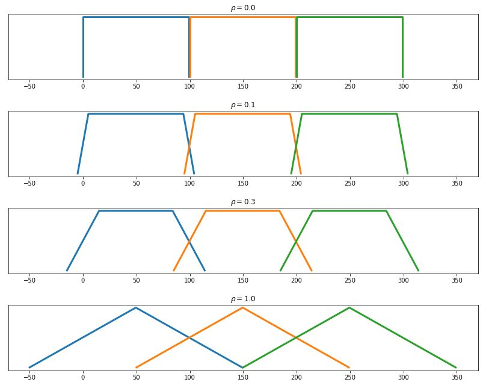
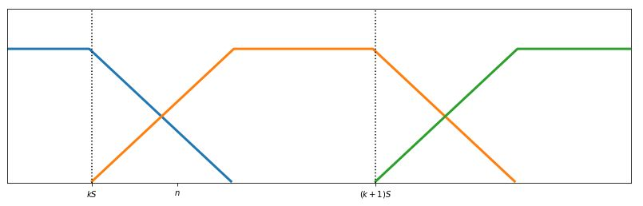
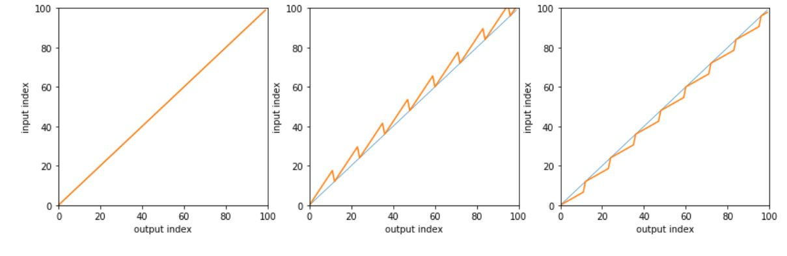

# The Formulas

The key technique behind simple pitch shifting is that of playing the audio file either more slowly \(to lower the pitch\) or faster \(to raise the pitch\). This is just like spinning an old record at a speed different than the nominal RPM value.

In the digital world we can always simulate the effect of changing an analog playing speed by using fractional resampling; for a refresher on this technique please refer to [Lecture 3.3.2 on Coursera](https://www.coursera.org/learn/dsp3/home/week/3). Resampling, however, has two problems:

* the pitch of speech is changed but so is its speed, which we don't want;
* the ratio of output to input samples for the operation is not one, so it cannot be implemented in real time.

To overcome these limitations, we can use _granular synthesis_: we split the input signal into chunks of a given length \(the _grains_\) and we perform resampling on each grain independently to produce a sequence of equal-length output grains.

### Grain rate vs length

In order to implement granular synthesis in real time we need to take into account the concepts of grain _length_ and grain _stride_. A grain should be long enough so that it contains enough pitched speech for resampling to work; but it should also be short enough so that it doesn't straddle too many different sounds in an utterance. Experimentally, the best results for speech are obtained using grains between 20 and 40ms.

The grain stride indicates the displacement in samples between successive grains and it is a function of grain length and of the _overlap_ between successive grains. With no overlap, the grain stride is equal to the grain length; however, overlap between neighboring grains is essential to reduce the artifacts due to the segmentation. Overlapping output grains are blended together using a _tapering window_; the window is designed so that it performs _linear interpolation_ between samples from overlapping grains.

Call $$\rho$$the amount of overlap \(as a percentage\) between neighboring grains. With $$\rho = 0$$there is no overlap whereas with $$\rho = 1$$all the samples in a grain overlap with another grain. The relationship between grain length $$L$$and grain stride $$S$$is $$L = (1+\rho)S$$. This is illustrated in the following figure for varying degrees of overlap and a stride of 100 samples; grains are represented using the shape of the appropriate tapering window:

Note that the stride is constant for any amount of overlap and that each grain starts at the same instants independently of overlap; this is the key observation that will allow us to implement granular synthesis in real time. 

### The grains' content

We can express the content of the $$k$$-th output grain as 

$$
g_k[m] = x(kS + \alpha m), \qquad 0 \leq m < L
$$

where $$x(t)$$is the interpolated, continuous-time version of the input signal and $$\alpha$$is the sampling rate change factor \(with $$\alpha < 1$$for subsampling, i.e. to lower the pitch, and $$\alpha > 1$$for upsampling, i.e. to raise the pitch\). In practice we will obviously perform local interpolation rather than full interpolation to continuous time. Note that the $$k$$-th grain starts at $$n=kS$$and is built using input data from $$n=kS$$as well.

### The tapering window

The tapering window is as long as the grain and it is shaped so that the overlapping grains are linearly interpolated. The left sloping part of the window is $$T$$samples long, where $$T=(L-S)/2 = \rho S/2.$$The sloping samples are therefore expressed by the formula

$$
w[n] = n/T, \qquad n = 0, \ldots, T-1.
$$

### The output signal

The full output signal can be expressed in closed form by looking at the following picture, which shows the periodic pattern of overlapping grains:

Any output index $$n$$can be written as 

$$
n = kS + m, \qquad k, m \in \mathbb{Z},  0 \leq m < S;
$$

$$k$$ is the index of the current grain and $$m$$ is the index of the sample _within_ the current grain. Note that the sample at $$n$$ is also the sample with index $$S+m$$ with respect to the _previous_ grain. With this, the output at $$n$$is the sum of the sample number $$m$$ from the current grain plus the sample number $$S+m$$from the previous grain; both samples are be weighed by the linear  tapering slope$$w[\cdot]$$:

$$
y[n] = w[S+m]g_{k-1}[S+m] + w[m]g_k[m]
$$

### Darth Vader, Chipmunks and causality

The algorithm that lowers the voice's pitch \(the "Darth Vader" voice transformer\) is strictly causal, that is, at any point in time we only need past input samples to compute the output. This is because lowering the pitch involves _oversampling_ and this operation is itself causal. 

We can look at it this way: in our granular synthesis approach we are filling the output grains with a resampled version of their original content. When we oversample, only a fraction of the grain's data will be used to regenerate its content; if a grain's length is, say, 100, and we are lowering the frequency by $$\alpha=2/3$$, we will only need 2/3 of the grain's original data to build the new grain. 

By contrast, the Chipmunk voice transformers uses local subsampling, that is, samples are being discarded to create an output grain and so, to fill the grain, we will need to "look ahead" and borrow data from beyond the original grain's end boundary. The algorithm therefore is noncausal but, crucially, we can exactly quantify the amount of lookahead and handle that with some buffering. For instance, if we are raising the frequency by $$\alpha=3/2$$ and our grain length is, say, 100 samples, we will need a buffer of extra 50 samples. This will result in an additional processing delay of 50 samples. 

The difference between over- and under-sampling is clear when we look at the illustration in the notebook that shows the input sample index as a function of the output sample index:

We will see in the next section that buffering is required anyway in order to implement overlapping windows, so that the extra buffering required by undersampling will just be an extension of the general setup.

