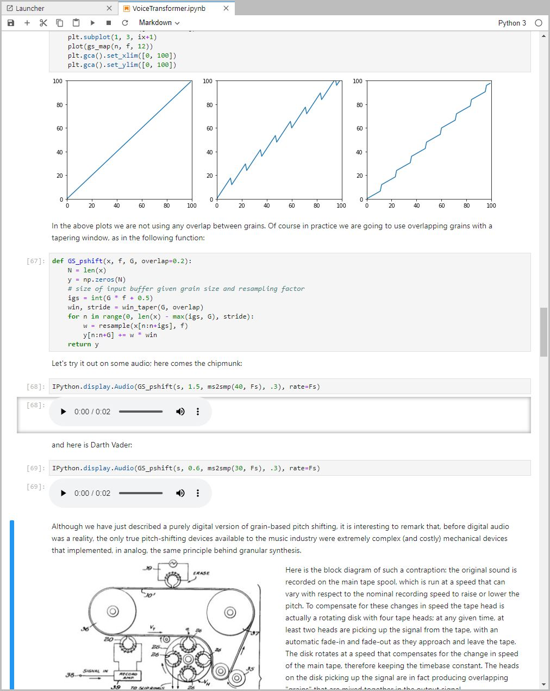

# Introduction

We will now start the interesting part of this module, the one where we start implementing actual audio DSP algorithms on the microcontroller. 

As we said in the beginning, the theme of our examples will be the design of increasingly more sophisticated voice transformers, that you can use in real time to modify the sound of your own voice. 

Before proceeding with this section, you should download and play with the [Voice Transformer Jupyter notebook](https://github.com/prandoni/COM303/tree/master/VoiceTransformer) that we prepared for this module. The notebook is also available in your [Coursera workspace in module DSP4](https://www.coursera.org/learn/dsp4/home/week/3) if you prefer not to run it locally.

In the notebook you will find a theoretical explanation of the algorithms that we will try to implement in the microcontroller, together with the code and with sound examples that you can listen to. 

Reading and understanding the notebook is fundamental to understanding the sections that follow since, from now on, we will focus solely on the implementation details associated to our specific hardware and on the need to implement the algorithms in strict real time.

